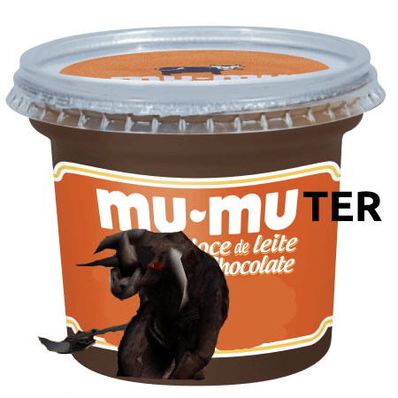

# Mu Online Selective Muter

## Description

Have you ever wondered if you can leave your MU Online character semi-afk, and only hear when the jewels drop, so that you can pick them up? Say no more, this is a hacky but 100% effective way of doing it. It basically overwrite all your sound effect files with an mute sound, except for the jewel sound.

# Running

- Clone the project;
- Copy your `Sound` folder from MU (located at /Data/Sound) into the same folder as this file;
- Run `node muMuter.js`;
- Overwrite your original Sound folder on at /Data/Sound;
- A backup of your original files will be created on the `bk` folder;

## Versions Tested

- v96;

## Troubleshooting
- If you get some file permission errors, you could try running this on an admin console;
- If you get some "file not found" errors, your Sounds source folder is not in the right place;

## Contributing
- It'd be great if people tested this on their multiple MU versions and seasons. It probably works on all of them, but you can never know for sure;
- Just clone the repo and fiddle with it, if you encounter an error or want to request a feature, you can PR a change or submit an issue;

## Roadmap

- [x] Basic functionality, for proof of concept;
- [x] Backup original files, so that you can revert if something goes wrong;
- [ ] Implement reversion to backup files;
- [ ] Implement CLI function so that the user can provide the MU sound folder;
- [ ] Decent error handling for exceptions (cleanup, etc);
- [ ] Compile an executable version for windows;
- [ ] Implement a .bat file that does the same;
- [ ] Make it able to accept a handful of sounds (e.g spell scrolls), not just gems;